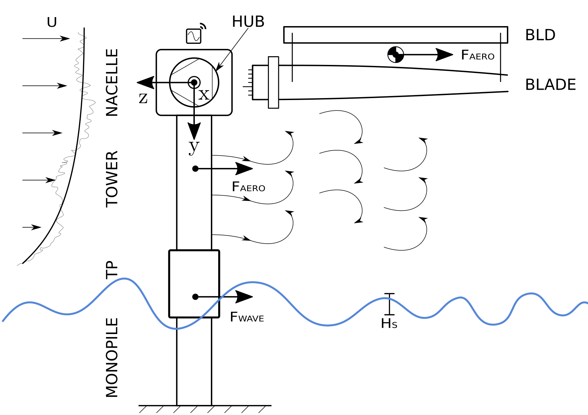

# mythicwind

## Overview

This repository contains scripts, libraries and notebooks used to investigate data from an offshore measurement campaign conducted during the installation of the offshore wind [farm trianel wind farm borkum II](https://www.trianel-borkumzwei.de/). 
The wind farm consists of 32 Senvion 6XM152 turbines. The installation took place between August 2019 and May 2020. 

An offshore wind turbine undergoing installation is interesting from a research point of view for several reasons:
- Simple geometry: turbine foundation and tower are both rotationally symmetric steel tubes. Rotational symmetry also leads to (approximate) isotrope structural characteristics in the plane normal to tower and foundation.
- High Reynolds number flow: Assuming a tower diameter of 6 m, and average wind speeds ranging from 5 m/s to 12 m/s under installation conditions, Reynolds numbers range from 4.5 million to 10.5 million. 
- Wave loading und full scale conditions.
- Practical relevance to improving the competability of offshore wind.

For fluid mechanics, closely monitoring offshore wind turbines under wind and wave loading thus compares to a full scale experiment. Monitoring 32 turbines undergoing installation thus enables the measurement a broad spectrum of different states. 



## Physical background

1. An offshore wind turbine under installation conditions can be simplified as a cantlivered beam 
(circular cross section, rotationally symmetric wall thickness) with an eccentric mass 
(nacelle with generator) vibrating transversally (fore-aft and side-side in the reference system of the nacelle) und wind and wave loads
2. Both wind and wave loads are stochastic and are described using statistical models.
3. Wave loads are a function of the sea state. For a sea states, the most important parameters are significant wave heigh H_m0 and Wave peak period T_P. To a lesser extend, wave direction, zero upcrossing period and maximum wave height are also important. Different statistical models can be used to describe the sea state and the relationship between significant wave heigh H_m0 and wave peak period. Most prominent in the North Sea is the JONSWAP spectrum. 
4. Wind loads are depending on wind speed, wind direction, shear factor and turbulence intensity. Different statistical models are available to describe the wind spectrum.
5. Wind and wave loads trigger a structural response of the turbine. The structural response depends on the loading spectrum as well as the transfer function. Furthermore the structural response is strongly depending on damping and elasticity of the structure. In turbines, damping is typically very low (~ 0.5 - 1.5 %). 
6. The response is dominated by the first Eigenfrequency of the turbine. As the turbine is assumed to be rotationally symmetric, the fore-aft and side-side mode are extremely close together if not indistinguishable [1]. 
7. The response has the characteristics of a narrow-band random vibration. A narrow-band random vibration is characterized by being dominated by a single, narrow frequency peak (here: first Eigenfrequency). The amplitude envelope follows a Rayleigh distribution and the phase angle is equally distributed between 0 and 2 pi. 
8. If viewed from above, the structural response describes a closed curve (orbit) which can be characterized by it shape (eccentricity), mean amplitude and direction. Mathematically speaking, this is a lissajous-figure, where the time series from one response direction is plotted as a function of the time series of the second response direction. 


[1]: under installation condition

---

## Experimental Setup

### Locations

Several locations were used to record data during the installation of the wind farm. They are listed in the following table:

| Location       | Description |
|----------------|-------------|
| helihoist-N    | data recorded from the helicopter hoisting platform atop the turbine nacelle. For most installations, two sensor boxes were deployed to ensure data availability. These are accounted for with the numbering (N) |
| tp             | Measurements from the transition piece |
| sbitroot       | Measurements from the blade lifting yoke's blade root side. The Z-axis is aligned to the blade main axis, X-Axis is perpendicular. |
| sbittip        | Measurements from the tip side of the blade lifting yoke. Z-axis aligned with the blade main axis, X-axis perpendicular | 
| damper         | Measurements from the tuned mass damper used during single blade installation |
| towertop       | measurements from inside the turbine tower at the upper lift plattform | 
| towertransfer  | measurements from atop the towers during sail out from the base harbour to the installation site |

---


## Raw data and data publication

Data is publicly available at <http://doi.org/10.5281/zenodo.4141208>

Investiagtions are ongoing, questions and contributions are welcome.

First results can be found here:


**OMAE 2020 :** Sander, A, Haselsteiner, AF, Barat, K, Janssen, M, Oelker, S, Ohlendorf, J, & Thoben, K. "Relative Motion During Single Blade Installation: Measurements From the North Sea." Proceedings of the ASME 2020 39th International Conference on Ocean, Offshore and Arctic Engineering. Volume 9: Ocean Renewable Energy. Virtual, Online. August 3–7, 2020. V009T09A069. ASME. <https://doi.org/10.1115/OMAE2020-18935>

**EURODYN 2020 :** Sander, A, Meinhardt, C & Thoben, KD. "Monitoring of Offshore Wind Turbines under Wind and Wave Loading during Installation" Proceedings of the EuroDyn 2020 XI International Conference on Structural Dynamics. Volume 1. Virtual, Online. November 23-26, 2020. <https://generalconferencefiles.s3-eu-west-1.amazonaws.com/eurodyn_2020_ebook_procedings_vol1.pdf>

### Organization of data

All data is stored in the data directory. NOTE: due to size limitations of git, the data is stored on [zenodo](http://doi.org/10.5281/zenodo.4141208)
For each turbine installation, a seperate folder can be found, e.g. turbine_01 for the first and turbine_16 for the 16th turbine. Turbine numbering follows the order of installation. 

Different data sources are organized in subfolders for each turbine dataset. Unfortunately, not every data source is available for each turbine.
Data sources are roughly sorted into categories. The following table lists these categories:

| Data type / data source | Description                                                            |
|-------------------------|------------------------------------------------------------------------|
| location / msr          | acceleration measurements, obtained by commercial accelerometer. For details, please refere to the [data description](doc/msr_data_description.md) |
| location / tom          | data from custom build sensor boxes. Data includes acceleration, angular acceleration, magnetic field, gnss recording and rough estimates of the eulerian angles. For detail refere to the [data description](doc/tom_data_description) |
| waves / wmb-sued        | Sea state statistics for the installatin period of the turbine. Details can be found in the [data description](doc/wmb-sued_data_description.md) | 
| waves / fino            | Sea state statistics from the german research platform [FINO1](htttps://) located approx. 6 km from the installation site.  Data description [here](doc/fino_wave_data_description.md) | 
| waves / waveradar       | Sea state statstics, recorded by a wave rider wave laser. Data description is available in the [docs](doc/wave-radar_data_description.md)
| wind / lidar            | high fidelity wind data recorded on the installation vessel during the installation of the wind farm. Details regarding data recording and data format can be found [here](doc/lidar_data_description.md) | 
| wind / scada            | 10 min. mean wind statistisc recorded on wind turbines in the vicinity of the installation site. This data is used in case no LIDAR data is available. Data description can be found [here](doc/scada_data_description.md) | 
| wind / anemometer       | During some of the installations, anemometers were present on the installation vessel. These recordings are sorted into this sub-subfolder. Data description is available [here](doc/anemometer_data_description.md) | 
| wind / fino             | Additonal wind statistics recorded by the FINO research station. Least recommended for investigations, as these recordings were taken approx. 6 km from the installation site. Data description [here](doc/fino_wind_data_description.md) | 

---

### Data folder structure

The data directory cotains two main folders: turbines and environment

```
turbines
└── turbine-NN
    ├── location
    │   ├── data_source_1
    │   │   ├── clean # -> sanitized raw data
    |   |   ├── processed # -> processed data / results
    |   |   |   ├── gps # -> contains uniq gps coordinates
    |   |   |   ├── acceleration_velocity_position # -> integrated vectors
```

```
environment
├── wind
|   ├── lidar
|   ├── scada
|   ├── scada
|   └── anemometer
└── waves
    ├── wmb-sued
    ├── waveradar
    └── fino
```

As an example, the (incomplete) data from turbine-04 is listed below:

```


```

### Data loading API (-> scikit-learn, nltk)

- Download in the background
- Time conversion sugar
- Code refers to data and vice versa


## Data processing

### Cleaning and sanitizing

- Installation phases
- Matching (in time)
- Nacelle orientation
- ...

### Analysis of Orbits

- Resampling
- Filtering
- Numerical integration
- Ellipse fitting
- Statistical analysis
- Amplitude envelope
- ...

