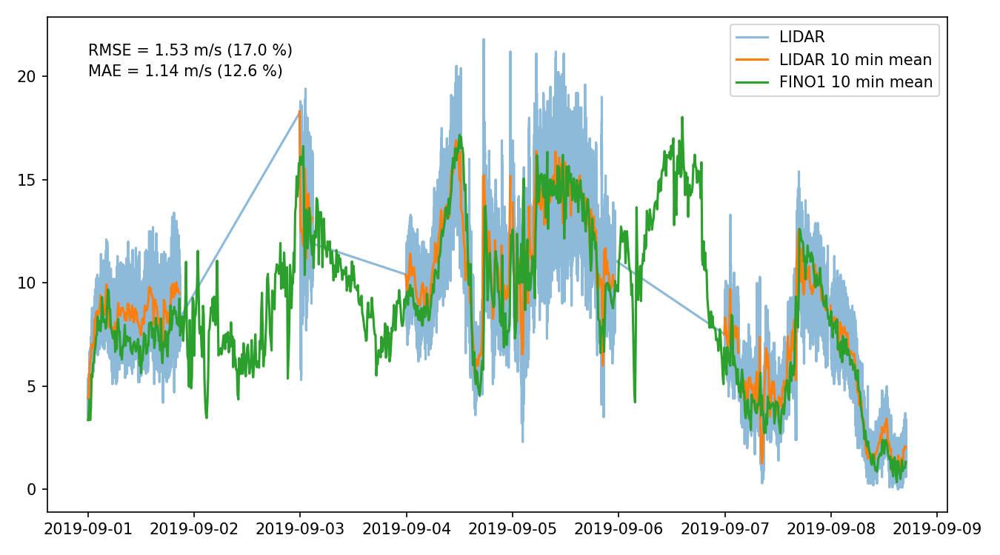

# LIDAR wind data description

## Overview

A Leosphere WindCube LIDAR was mounted on the installation vessel _Taillevent_ to record the atmospheric boundary layer during installatio.

The data recorded by the lidar was exported as csvs and provided by the vessel operator. The raw data includes the following parameters

| Parameter       | Description |
|-----------------|-------------|
| datetime        | human readable time stamp (time zone aware!) [YYYY-MM-DD HH:MM:SS+XX:XX] |
| epoch           | time stamp as a unix epoch [s] |
| wind_speed_N    | The wind speed at the N'th return level [m/s] |
| wind_dir_N      | Wind direction at the N'th return level in the vessels reference frame [degree] |
| wind_dir_N_corr | Wind direction at the N'th return level due North [degree due North] |
| heigh_N         | The height of the lidar return level [m] |

---

Data is resampled to a 1 s return interval.

## Data validation

To validate the lidar postprocessing, lidar data was compared to wind data recorded at the FINO1 platform, located approximately 6 km from the installation site. As a means to quantify goodness of measure both the root-mean-square-error as well as the mean absolute error was calculated. While deviations can be observed, the temporal fit is quite good.

