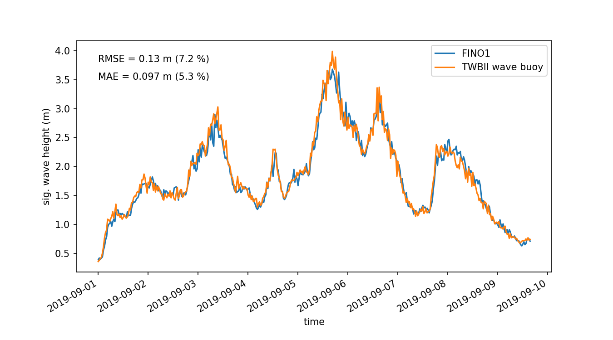

# wave data description

## Overview

Wave data was recorded using a waverider wave buoy (DWR-G). The wave rider buoy was located at 54 00' 238'' degree North and 6 26' 553'' degree East. In decimals: 54.0031096 North, 6.4425532 East.

Based on the raw data, sea state statistics were derived with a return period of 30 minutes.

More information on the wave buoy can be found in the manufacturers [data sheet](datawell_brochure_dwr4_acm_b-38-07.pdf).

## Data format and parameters

The data comes as csv, column oriented text files. The first line entails parameter names and units and is commented out by a hashbang (unix commentary). The data is a combination of two different data files as provided by the buoy: \*.HIS Data Text File (History of Spectrum parameters) and \*.HIW Data Text File (History of Wave Statistics). This results in the two timestamps in the data file because history of wave statistics data is available immediately after each measurement time period, whereas history of spectrum parameters take approx. 5 minutes to calculate by the buoy and thus have a slightly later time stamp. For actual postprocessing purposes, a third timestamp rounded to  full half hour is used.

Parameters included in the data files are:

| Parameter name | Description |
|----------------|-------------|
| epoch          | the date and time of the spectrum that is summarized in this line. Time format is unix epoch [s] |
| Tp             | Tp := 1 / fp, peak period, the frequency at which S(f) is maximal [s]|
| Dirp           | peak direction, the direction at f = fp [deg due North]|
| Sprp           | peak spread, the directional spread at f = fp [s]|
| Tz             | Tz := sqrt(m0 / m2), zero-upcross period [s]|
| Hm0            | Hm0 := 4*sqrt(m0), the significant waveheight [m]|
| TI             | TI := sqrt(m[-2] / m0), integral period [s]|
| T1             | T1 := m0 / m1, mean period [s]|
| Tc             | Tc := sqrt(m2 / m4), crest period [s]|
| Tdw2           | Tdw2 := sqrt(m[-1] / m1) [s]|
| Tdw1           | Tdw1 := sqrt(m[-1,2] / m0) [s]|
| Tpc            | Tpc := m[-2] * m1 / m0 ^ 2, calculated peak period [s]|
| nu             | nu := sqrt((T1 / Tz) ^ 2 - 1), band width parameter [-]|
| eps            | eps := sqrt(1 - (Tc / Tz) ^ 2), bandwidth parameter [-]|
| QP             | QP := 2 * m[1,2] / m0 ^ 2, Goda's peakedness parameter [-]|
| Ss             | Ss :=2 * pi / g * Hs / Tz ^ 2, significant steepness [-]|
| TRef           | TRef, reference temperature (25deg) [C]|
| TSea           | TSea, sea surface temperature [C]|
| Bat            | Bat, battery status (0..7) |
| m[n]           | m[n] := Integral from f=0 to f=Inf over S(f) * f ^ n |
| m[n,2]         | m[n,2] := Integral from f=0 to f=Inf over S(f) ^ 2 * f ^ n |
| Percentage     | Percentage of data with no reception errors [%] | 
| Hmax           | Height of the highest wave [cm] |
| Tmax           | Period of the highest wave) [s] |
| H(1/10)        | Average height of 10% highest waves [cm] |
| T(1/10)        | Average period of 10% highest waves [s] |
| H(1/3)         | Average height of 33% highest waves [cm] |
| T(1/3)         | Average period of 33% highest waves [s] |
| Hav            | Average height of all waves [cm] |
| Tav            | Average period of all waves) [s] |
| Eps            | bandwidth parameter |
| \#Waves        | Number of waves|

---

Note: the m's are moments of the power spectral density S(f).

## Validation of data

To validate the data, measurements from the FINO1 platform, located approximately 6 km from the installation site were compared to wave buoy measurements. To estimate the goodness of measurements, the root mean square error (RMSE) as well as the mean absolute error (MAE) were calculated. 

